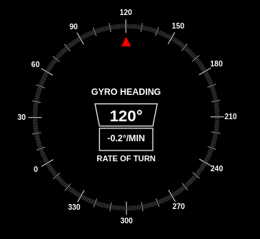

# Gyroscope Heading Indicator

A modern React component that simulates a maritime/aviation gyroscope heading indicator with real-time display of heading and rate of turn.



## Features

- **Digital Compass Display**: Shows current heading in degrees (0-360°)
- **Smooth Animation**: Realistic rotation transitions
- **Rate of Turn Indicator**: Displays turning rate in degrees per minute
- **High-Contrast Design**: Clear visibility with dark mode aesthetics
- **Responsive Layout**: Adapts to different screen sizes
- **Real-time Updates**: Smooth updates to heading and rate of turn

## Installation

```bash
npm install npm i gyroscope-mdby-digvijay
# or
yarn add npm i gyroscope-mdby-digvijay
```

## Usage

```jsx
import GyroscopeIndicator from 'npm i gyroscope-mdby-digvijay';

function App() {
  return (
    <div>
      <GyroscopeIndicator />
    </div>
  );
}
```

## Props

| Prop | Type | Default | Description |
|------|------|---------|-------------|
| heading | number | 0 | Current heading in degrees |
| rateOfTurn | number | 0 | Rate of turn in degrees/minute |
| size | string | '256px' | Size of the component |

## Working Principle

1. **Rotating Dial (Compass Scale)**
   - The outer scale rotates based on the current heading
   - Degree markers (0° to 360°) indicate the direction

2. **Fixed Arrow (Red Marker)**
   - Always points to 0° (North) as a reference
   - The rotating scale moves around it, showing the current heading

3. **Current Heading Display**
   - Shows the numerical heading in degrees at the center
   - The heading gradually animates smoothly to the new value

4. **Rate of Turn (ROT)**
   - Displays how fast the heading is changing (degrees per minute)
   - Indicates if the vessel is turning left or right

## Technical Details

- Built with React and Tailwind CSS
- Smooth animations using CSS transitions
- SVG-based markers for crisp rendering
- Optimized for performance with minimal re-renders

## Contributing

Contributions are welcome! Please feel free to submit a Pull Request.

## Author

**Digvijay Bendre**

## License

MIT © [Digvijay Bendre]